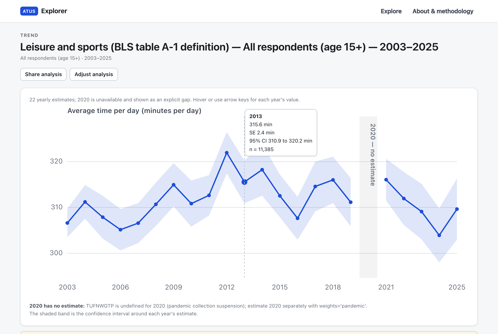

# ATUS Analysis Platform

A platform for analyzing how Americans spend their time, built on the official
[American Time Use Survey (ATUS)](https://www.bls.gov/tus/) microdata published
by the U.S. Bureau of Labor Statistics (BLS). ATUS is the only federal survey
that measures how people divide their days — one respondent per sampled
household reports a complete 24-hour diary of activities, coded against a
hierarchical activity lexicon, together with rich demographic, labor-force, and
household context.

**Current status: Phase 4 — Interactive Web Application complete.** Phase 1
turned the official BLS 2003–2025 multi-year microdata into a validated
PostgreSQL database; Phase 2 added a statistical engine producing weighted
time-use estimates with official replicate-weight standard errors — validated
by reproducing 24 published BLS numbers exactly (`atus validate-analytics`);
Phase 3 exposes that engine through a documented, versioned, cached HTTP API
(`atus api`, OpenAPI at `/docs`); Phase 4 adds **ATUS Explorer**
([frontend/](frontend/)) — a React application through which a nontechnical
user can build estimates, trends, and group comparisons, see the uncertainty
and methodology behind every number, and share any analysis as a URL that
reproduces it. The frontend consumes the API as its single source of
numerical truth: no statistics are computed client-side. Production hardening
and deployment are Phase 5.

```bash
atus analyze estimate --activity sleep --year 2025
# 541.96 min/day (9.03 h)   SE 2.166   95% CI [537.72, 546.21]
# 6,146 respondents · represents 277,984,657 persons on an average day

atus analyze trend --activity leisure_and_sports_bls_table --start-year 2003 --end-year 2025
atus analyze compare --activity household_activities_bls_table --year 2025 \
    --group-a sex=male --group-b sex=female

atus api    # then: curl -X POST http://127.0.0.1:8000/api/v1/analysis/estimate \
            #   -H 'Content-Type: application/json' -d @docs/examples/api/sleep_2025_estimate.json
```

## Architecture

```text
Official BLS files (bls.gov)
        │  atus download          acquisition + provenance manifest
        ▼
data/raw/            immutable zip archives
        │  atus extract           streaming extraction
        ▼
data/staging/0325/   staged CSV data files
        │  atus validate-source   headers, official row counts, survey years
        │  atus load              pure-Python row transforms → COPY (atomic rebuild)
        ▼
PostgreSQL  schema "atus"   canonical tables + lexicon + provenance metadata
        │  atus validate-db       ~38 data-quality checks (diary arithmetic,
        │                         weights, referential integrity, BLS cross-checks)
        ▼
Analytical engine (atus_pipeline.analytics)     ← Phase 2
        │  AnalysisSpec → population/activity SQL → sufficient statistics
        │  → estimators (User's Guide ch. 7.4) → replicate variance (ch. 7.5)
        │  atus analyze …          estimates, trends, comparisons (+ JSON)
        │  atus validate-analytics reproduces 24 official BLS numbers
        ▼
Read-only HTTP API (atus_pipeline.api)          ← Phase 3
        │  atus api → FastAPI: /api/v1/analysis/{estimate,trend,compare},
        │  activity lexicon + population metadata + meta/capabilities,
        │  structured errors, versioned result cache (11 s → 4 ms), OpenAPI
        ▼
ATUS Explorer (frontend/)                       ← Phase 4
        │  React + TypeScript SPA: analysis builder driven by the API's
        │  discovery endpoints, uncertainty-first result views, explicit
        │  2020 gaps, shareable analysis URLs (spec-encoded, stateless)
```

Details: [docs/architecture.md](docs/architecture.md),
[docs/analytics.md](docs/analytics.md), [docs/api.md](docs/api.md), and
[docs/frontend.md](docs/frontend.md).

### ATUS Explorer



Every number in the UI comes from the API: estimates carry standard errors
and confidence intervals, methodological warnings are always displayed, 2020
renders as a labeled gap rather than an interpolated value, and the "Share
analysis" URL encodes the full canonical specification so anyone can
reproduce the result.

## Technology

| Choice | Why |
| --- | --- |
| Python 3.11+ (stdlib `csv` streaming, no dataframe library) | transformations are row-wise and pure; streaming keeps memory flat across multi-GB files |
| PostgreSQL 16 | relational integrity (FKs, CHECKs) matches the survey's structure; strong analytical SQL for Phase 2 |
| psycopg 3 + COPY protocol | bulk-loads ~13M rows in minutes while keeping per-row typed transforms |
| Plain-SQL migrations + ~100-line runner | the whole schema mechanism is readable; checksummed, ordered, re-runnable |
| `curl_cffi` for acquisition | bls.gov rejects non-browser TLS clients (see [docs/source-data.md](docs/source-data.md)) |
| pytest (unit / integration / data-quality markers) | fast tests need no DB; integration tests build a disposable DB; full-data checks are opt-in |

## Quick start

Prerequisites: Python 3.11+, Docker (or any PostgreSQL 14+), ~6 GB free disk
(0.6 GB downloads + 2.8 GB staged files + ~2 GB database).

```bash
# 1. install
python3 -m venv .venv && source .venv/bin/activate
pip install -e ".[dev]"

# 2. configure (defaults work with the compose file below)
cp .env.example .env

# 3. database
docker compose up -d          # PostgreSQL 16 on localhost:5434
atus migrate                  # create the schema

# 4. data (~600 MB download from bls.gov, ~2.8 GB staged)
atus download
atus extract
atus validate-source          # headers + official BLS record counts

# 5. load (~13M rows, single atomic transaction; a few minutes)
atus load

# 6. verify
atus validate-db              # full data-quality suite
atus validate-analytics       # reproduce 24 official BLS estimates end-to-end
atus status

# 7. analyze (Phase 2 engine; see docs/examples.md)
atus analyze estimate --activity sleep --year 2025

# 8. serve the HTTP API (Phase 3; OpenAPI docs at http://127.0.0.1:8000/docs)
#    the frontend origin must be allowed for CORS:
#    ATUS_API_CORS_ORIGINS=http://localhost:5173 in .env
atus api

# 9. run ATUS Explorer (Phase 4; requires Node 20+)
cd frontend && npm install && npm run dev    # http://localhost:5173
```

Frontend commands (from `frontend/`): `npm run dev`, `npm run build`,
`npm test` (unit/component), `npm run test:e2e` (Playwright against a
fixture-database API), `npm run typecheck`, `npm run lint` — see
[docs/frontend.md](docs/frontend.md).

If `atus download` is blocked (BLS adjusts its bot protections from time to
time), download the files listed in [docs/source-data.md](docs/source-data.md)
manually in a browser, drop them into `data/raw/`, and re-run `atus download`
(it records provenance for existing files without re-fetching) followed by the
remaining steps.

## Testing

```bash
pytest tests/unit                          # pure functions, no DB (fast)
pytest tests/integration                   # needs PostgreSQL; builds atus_test DB
ATUS_DATA_QUALITY=1 pytest tests/data_quality   # needs the fully loaded DB
```

Integration tests use `ATUS_TEST_DATABASE_URL` (default: the compose instance,
database `atus_test`) and never touch the real `atus` database.

## What's in the database

Seven canonical tables mirror the conceptual structure of the survey — see
[docs/database.md](docs/database.md) for grains, keys, and indexes:

- `atus.respondents` — one row per respondent/diary day (258,954), with survey
  weights, labor-force status, earnings, and household context
- `atus.household_members` — household roster incl. the respondent (702,409)
- `atus.activities` — diary episodes with harmonized activity codes, start/stop
  times, durations (4,994,172)
- `atus.activity_companions` — who was present during each episode (6,358,042)
- `atus.cps_persons` — CPS demographics/geography for respondent households
- `atus.replicate_weights`, `atus.pandemic_replicate_weights` — 160 replicate
  weights per respondent for variance estimation
- `atus.activity_tier1/2` + `atus.activity_codes` — the official three-level
  activity lexicon (18 / 107 / 431 entries), extracted from the BLS coding
  lexicon PDF
- `atus.ingestion_runs`, `atus.source_files`, `atus.validation_results` —
  provenance and validation history

Methodological ground rules (read before analyzing): survey weights are
mandatory for population statements; 2020 is a partial year with its own
weight; the multi-year weight `TUFNWGTP` is the only weight valid across
years. All of it is documented with BLS citations in
[docs/methodology.md](docs/methodology.md).

## Repository layout

```text
src/atus_pipeline/    pipeline package (acquisition, staging, validation,
                      transformation, loading, database, cli) and the
                      analytics/ package (Phase 2 statistical engine)
migrations/           plain-SQL schema migrations, applied in order
data/reference/       committed reference data (activity lexicon CSV)
data/raw|staging/     downloaded + staged BLS files (gitignored)
scripts/              one-time generation scripts (lexicon PDF → CSV)
tests/                unit / integration / data_quality suites
docs/                 architecture, database, lineage, methodology, sources, roadmap
```

## Documentation

- [docs/architecture.md](docs/architecture.md) — pipeline stages and design decisions
- [docs/analytics.md](docs/analytics.md) — the statistical contract: estimators, weights, variance, filters
- [docs/examples.md](docs/examples.md) — worked example analyses with real outputs
- [docs/database.md](docs/database.md) — schema reference (grain, keys, indexes, ER diagram)
- [docs/data-lineage.md](docs/data-lineage.md) — every canonical column traced to its BLS variable
- [docs/methodology.md](docs/methodology.md) — weights, the 2020 disruption, cross-year comparability
- [docs/source-data.md](docs/source-data.md) — the official files, how they're obtained, provenance
- [docs/adr/](docs/adr) — decision records for the analytical layer (ADR-001…006)
- [docs/roadmap.md](docs/roadmap.md) — phase plan

## Authoritative references

- [ATUS microdata files](https://www.bls.gov/tus/data.htm) · [2003–2025 files](https://www.bls.gov/tus/data/datafiles-0325.htm)
- [ATUS User's Guide](https://www.bls.gov/tus/atususersguide.pdf)
- [2003–25 Interview Data Dictionary](https://www.bls.gov/tus/dictionaries/atusintcodebk0325.pdf) · [ATUS-CPS Data Dictionary](https://www.bls.gov/tus/dictionaries/atuscpscodebk0325.pdf)
- [2003–2025 Activity Coding Lexicon](https://www.bls.gov/tus/lexicons/lexiconnoex0325.pdf)
- [Changes between data files across years](https://www.bls.gov/tus/lexicons/changes.pdf)
- [COVID-19 impact on 2020 ATUS data](https://www.bls.gov/tus/notices/2021/covid19tech.htm)

## Roadmap

Phase 1 — data acquisition, modeling, ETL, validation, database. ✅
Phase 2 — statistical/analytical engine (official estimators, replicate-weight
variance, trends, comparisons, BLS benchmark validation). ✅
Phase 3 — read-only HTTP API over the engine (versioned contract, structured
errors, result caching, benchmarks replayed over HTTP). ✅
Phase 4 — interactive web application. Phase 5 — hardening and deployment.
See [docs/roadmap.md](docs/roadmap.md).
