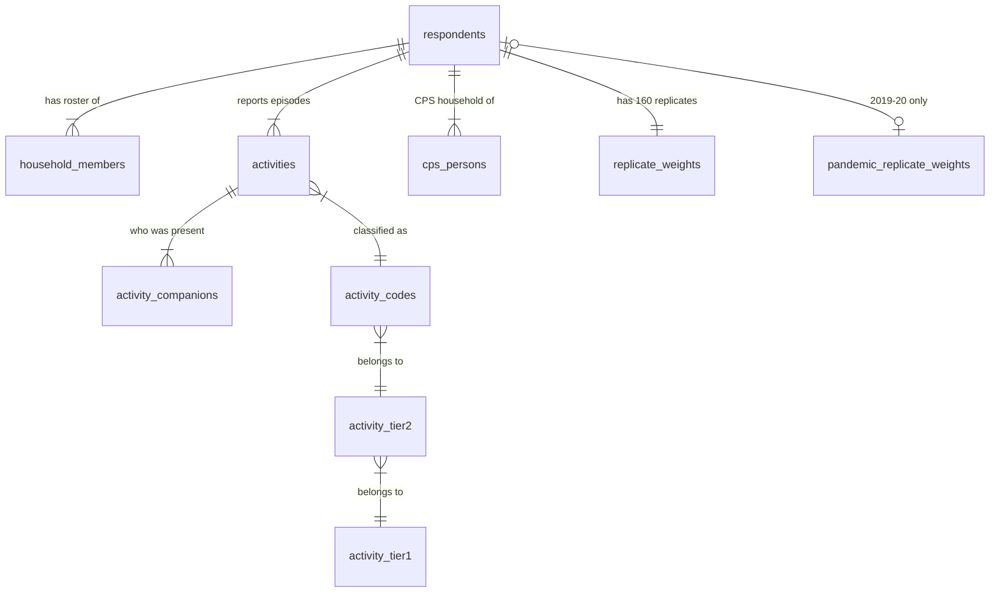

# Database Reference

All canonical data lives in the PostgreSQL schema `atus`, created by the
migrations in `migrations/`. Column-by-column source mapping is in
[data-lineage.md](data-lineage.md); this document covers structure: what each
table is, its grain, its keys, and how the tables relate.

## Entity-relationship overview

The respondent (identified by `tucaseid`) is the hub: ATUS interviews exactly
one person per sampled household about exactly one 24-hour diary day, so
"respondent", "case", and "diary day" are the same grain.

## Canonical tables

### `atus.respondents` — 258,954 rows

One row per ATUS respondent (= one completed diary day), 2003–2025.
**PK** `tucaseid` (14-digit BLS case ID, stored as `bigint`).
Source: Respondent file, curated columns.

Contents: survey year and diary date/day-of-week/holiday flag; labor-force
status, multiple-job flag, full/part-time, usual hours (with the "hours vary"
answer preserved as its own boolean), class of worker, major industry and
occupation recodes, weekly/hourly earnings (implied decimals converted to
real decimals); school enrollment; spouse/partner presence and employment;
household size and children; eldercare and secondary-childcare summary
minutes; BLS-computed time-with-whom totals (`time_alone_minutes`,
`time_with_family_minutes`); and the two statistical weights:

- `final_weight` (`TUFNWGTP`) — the multi-year weight, NULL **only** for 2020
  (enforced by the CHECK constraint `final_weight_2020_rule`);
- `pandemic_weight` (`TU20FWGT`) — defined only for 2019/2020 (CHECK
  `pandemic_weight_years`).

Notable CHECKs: `data_year >= 2003`, `diary_day_of_week` 1–7, coded columns
restricted to their documented value sets.

### `atus.household_members` — 702,409 rows

One row per person on the ATUS household roster: household members **and** the
respondent's own non-household children under 18 (`relationship = 40`). The
respondent is always `lineno = 1`.
**PK** `(tucaseid, lineno)`; **FK** → `respondents`.
Columns: relationship to respondent (TERRP codes 18–40), age (topcoded 80 in
2003–04, 85 from 2005), sex.

### `atus.activities` — 4,994,172 rows

One row per diary activity episode.
**PK** `(tucaseid, activity_number)`; **FKs** → `respondents`,
`activity_codes`, `activity_tier2`, `activity_tier1`.

The diary runs 04:00 → 04:00 the next day. Episodes may cross midnight
(`stop_time < start_time` is legitimate), and the *final* episode's
`stop_time` may run past 04:00: `duration_minutes` (`TUACTDUR24`) is capped at
the 04:00 boundary so every diary sums to exactly 1440, while
`duration_uncapped_minutes` (`TUACTDUR`) is the full reported duration.
`cumulative_minutes` (`TUCUMDUR24`) is the running within-day total —
validation verifies it equals the recomputed running sum for all 5M episodes.

Activity classification is stored three ways on purpose (`activity_code`
char(6), `tier2_code` char(4), `tier1_code` char(2), with CHECKs that the
prefixes agree): all three levels are query entry points ("time watching TV"
vs. "time in leisure"), and each carries an FK into the lexicon tables.

Also: location code (`TEWHERE`, NULL where not collected — sleeping/grooming),
secondary-childcare and eldercare minutes for the episode.

### `atus.activity_companions` — 6,358,042 rows

One row per "who was present" record per episode, mirroring the BLS Who file
exactly.
**PK** `(tucaseid, activity_number, who_lineno, who_code)`;
**FK** `(tucaseid, activity_number)` → `activities`.

This table intentionally keeps BLS sentinel values because they are
structural, not missing data (both sentinel columns are part of the key):

- `who_lineno >= 1` — the companion is a household roster member; the value is
  their roster `lineno` (validated to resolve against `household_members`);
- `who_lineno = -1` — nonhousehold companion (codes ≥ 40), or no who
  information for the episode;
- `who_code = -1` with `who_not_asked = true` — placeholder row for episodes
  where the who question is never asked (sleeping/grooming in all years;
  working episodes in 2003–09). Validation ensures placeholders are the only
  row for their episode;
- `who_code` ∈ {−1, −2, −3} with `who_not_asked = false` — asked, but blank /
  don't know / refused (1,208 rows in 2003–25).

### `atus.cps_persons` — one row per person in a respondent's CPS household

Demographics measured at the final CPS interview, 2–5 months **before** the
diary day: age, sex, education, race, Hispanic ethnicity, marital status,
citizenship, CPS labor-force status, household composition/tenure/income, and
the only geography in ATUS (Census region/division, state FIPS, metro status).
**PK** `(tucaseid, lineno)`; **FK** → `respondents`.

Two deliberate scope decisions, documented in
[source-data.md](source-data.md): only a curated subset of the 265 source
columns is loaded, and only households of actual respondents (the source file
also covers sampled persons who never completed an ATUS interview; those rows
remain in staging). The era-split variable pairs keep their BLS names
(`gemetsta`/`gtmetsta`, `hufaminc`/`hefaminc`) as a signal that their category
definitions changed mid-survey.

### `atus.replicate_weights` — 258,954 rows

160 successive-difference replicate weights for `TUFNWGTP`, one row per
respondent, kept **wide** (`tufnwgtp001` … `tufnwgtp160`) mirroring the BLS
file: variance estimation always uses all 160 replicates of a row together
(User's Guide ch. 7), and a long format would be 41M rows for no analytical
gain. All 160 columns are NULL exactly for 2020 respondents (validated).
**PK/FK** `tucaseid` → `respondents`.

### `atus.pandemic_replicate_weights` — 18,217 rows

160 replicate weights for `TU20FWGT`, covering exactly the 2019 and 2020
respondents (validated in both directions). Same shape as above.

## Reference tables (activity lexicon)

`activity_tier1` (18 rows) → `activity_tier2` (107) → `activity_codes` (431),
extracted from the official 2003–2025 Coding Lexicon PDF by
`scripts/extract_lexicon.py` into the committed CSV
`data/reference/activity_lexicon_0325.csv`. Six-digit entries carry the BLS
harmonization note where present (e.g. `020681` "includes 020601 (all years),
020602 (2008 and later years)"), preserving how the multi-year files absorbed
retired codes. Hierarchy integrity (prefix relationships) is enforced by
CHECKs and FKs, and the set of codes was verified to exactly match both the
Activity Summary file's `t`-columns and every code appearing in the 4.99M
episodes.

## Metadata tables

- `ingestion_runs` — one row per `atus load` invocation: release, pipeline
  version, timestamps, `running/succeeded/failed`, error notes for failures.
- `source_files` — per run: every source file's URL, SHA-256, size, staged row
  count, loaded table and loaded row count. Answers "which exact bytes
  produced the data currently in this database?"
- `validation_results` — every `atus validate-db` check outcome with
  severity, observed value, and detail, timestamped.

## Indexes (migration 0002)

Primary keys already serve per-respondent joins because every child key is
prefixed by `tucaseid`. Secondary indexes target foreseeable Phase 2 access
paths, and nothing else:

| Index | Workload |
| --- | --- |
| `respondents(data_year)`, `respondents(diary_date)` | trends, year filters, 2020 partial-year windows |
| `activities(activity_code)`, `(tier2_code)`, `(tier1_code)` | "time spent on X" aggregation at any hierarchy level |
| `activity_companions(who_code)` | "time with whom" queries |
| `cps_persons(state_fips)` | geographic filtering |

## Conventions

- Canonical columns use descriptive snake_case names; the BLS variable name
  for every column is in [data-lineage.md](data-lineage.md). Replicate-weight
  columns and era-split CPS pairs keep BLS names (rationale above).
- ATUS sentinels (−1 blank / −2 don't know / −3 refused) become NULL in
  analytical columns; `-4` "hours vary" is preserved as `usual_hours_vary`;
  structural sentinels in `activity_companions` are preserved as-is. The
  distinction blank/DK/refused remains recoverable from the staged files.
- Codes whose meaning changed across years (industry/occupation
  classifications, metro status, family-income bands) are stored as-is with
  the survey year available on every row; see
  [methodology.md](methodology.md) before comparing them across years.
